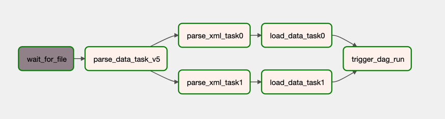

# xml-graph-pipeline
Load UniProt XML data into Neo4j.

Using Airflow to create the data pipeline. Here's the pipeline:



Pipeline description:
1. Monitor an existing directory (~/uniprot_data) for new files.
2. Check for the existing data files. Take first 2 files and create 2 branches to run in parallel. Use xcom to push file names.
3. Parse xml files. Use xcom to take file names pushed in previous step. Generate data model.
4. Load data from previous step into neo4j. Move xml file in ~/uniprot_data_processed dir.
5. Repeat.

This way the pipeline will process data as it comes. You can create multiple branches to scale.
Main code used by airflow pipeline can be found in app/airprot/pipeline.py.
Airflow pipeline can be found in airflow/dags/uniprot_pipeline.py
Also added some basic tests (using pytest) to test the pipeline code.

## Install
The makefile script was tested on Mac. Airflow is deployed using pip and neo4j runs from docker.

There's a makefile which is almost completely automated:
```
AIRFLOW_REPLICAS=1
AIRFLOW_VERSION=2.1.4
AIRFLOW_HOME=$(HOME)/airflow
AIRFLOW__CORE__SQL_ALCHEMY_CONN=<put here airflow db connection string>
AIRFLOW_DAGS="$(HOME)/airflow/dags"
NEO_HOME=/Users/adriandolha/neo/data

install-airflow:
	export AIRFLOW_HOME=$(AIRFLOW_HOME) && \
	export AIRFLOW__CORE__SQL_ALCHEMY_CONN=$(AIRFLOW__CORE__SQL_ALCHEMY_CONN)  && \
	pip install "apache-airflow[celery, mysql]==2.5.2" --constraint "https://raw.githubusercontent.com/apache/airflow/constraints-2.5.2/constraints-3.9.txt"

airflow-initdb:
	export AIRFLOW_HOME=$(AIRFLOW_HOME) && \
	export AIRFLOW__CORE__SQL_ALCHEMY_CONN=$(AIRFLOW__CORE__SQL_ALCHEMY_CONN)  && \
	airflow db init

# Add admin user
airflow-create-admin-user:
	export AIRFLOW_HOME=$(AIRFLOW_HOME) && \
	export AIRFLOW__CORE__SQL_ALCHEMY_CONN=$(AIRFLOW__CORE__SQL_ALCHEMY_CONN)  && \
	airflow users create -u admin -p admin -f admin -l admin -r Admin -e admin@mailhog.local

# Start airflow web
airflow-web:
	export AIRFLOW_HOME=$(AIRFLOW_HOME) && \
	export AIRFLOW__CORE__SQL_ALCHEMY_CONN=$(AIRFLOW__CORE__SQL_ALCHEMY_CONN)  && \
	airflow webserver -p 8080

# Install pipeline code that will be used in airflow pipeline
install-uniprot:
	cd app && \
	pip install -r requirements.txt  && \
	python setup.py install

# Copy updated dag to airflow dags folder
install-dag:
	cp -r airflow/* $(AIRFLOW_HOME)

# Generate new xml files to trigger the pipeline
generate-data:
	python -c "from uniprot import pipeline; pipeline.generate_data(1)"

# Start airflow scheduler
airflow-scheduler:
	export AIRFLOW_HOME=$(AIRFLOW_HOME) && \
	export AIRFLOW__CORE__SQL_ALCHEMY_CONN=$(AIRFLOW__CORE__SQL_ALCHEMY_CONN)  && \
	airflow scheduler
	
# Start neo4j (no auth) 
neo4j:
	docker run \
      --publish=7474:7474 --publish=7687:7687 \
      --volume=$(NEO_HOME)/data:/data \
      --env=NEO4J_AUTH=none \
      neo4j:latest

```